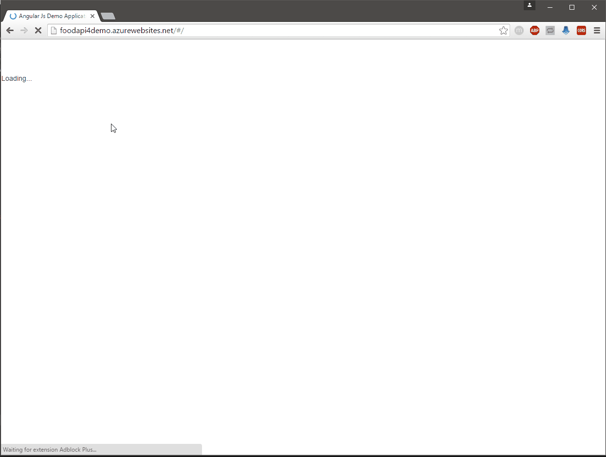

# .NET Day 2017 Demo Application

## ASP.NET Core WebAPI / Angular Demo 

* Component based design
* Webpack
* Ahead-of-Time (Aot) Compilation
* Lazy Loading 
* Treeshaking 
* Code splitting
* Cross Platform

Server and Client are completely seperated that you can exchange the endpoint easily.

### Check the corresponding package.json for the npm commands to start the repository

## Prerequisites 

Please install cordova globally to handle cross platform 

```npm install cordova -g```

* [Android SDK](https://developer.android.com/sdk/index.html)
* [Windows 10 SDK](https://dev.windows.com/en-us/downloads/windows-10-sdk)

## Client

This client is implemented with Angular and Webpack. You can start the application by running

```yarn```

and 

```npm start```

the application starts and runs in your default browser.

By typing 

```npm run webpack-dev```

the application is build without treeshaking and AoT in a .dist/web/jit folder.

If you type

```npm run webpack-prod```

the application is build with treeshaking and AoT in a .dist/web/aot folder.

After the aot compilation you can start the application by typing

`npm run lite`

You can build Cross Platform by typing

```npm run build-all```

for building Web, Desktop (Windows and Linux) and Apps for Android and Windows Phone in the .dist folder.


# Demo

You can see an Angular Demo with all the techniques combined here (running on Azure)

## Frontend

[http://foodapiui.azurewebsites.net/](http://foodapiui.azurewebsites.net/)

## Backend
[http://foodapi4demo.azurewebsites.net/](http://foodapi4demo.azurewebsites.net/)

